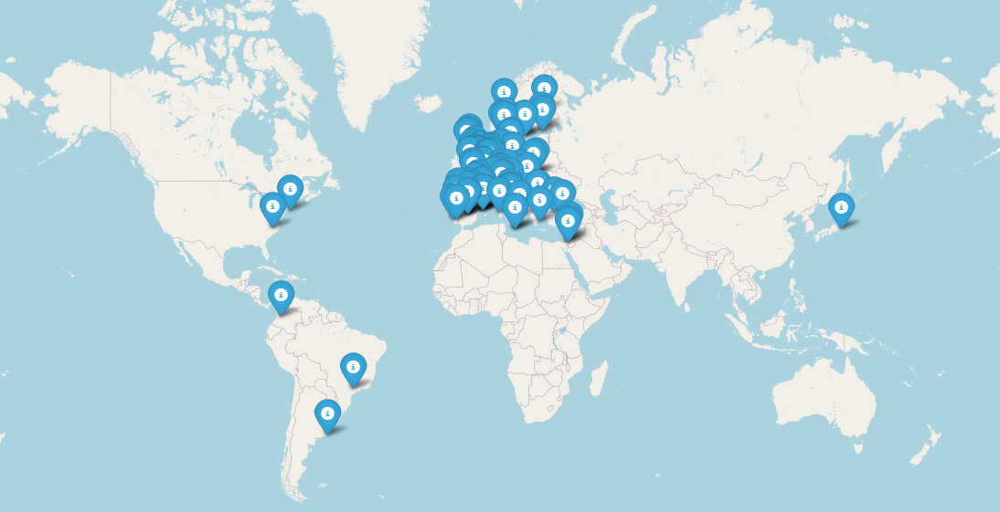

# Grevia Project

This is the main folder of the Grevia Project,developed during the EIT FOOD-RIS-INSPIRE-SUMMER-SCHOOL-2024.It is a prototype web application designed to support farmers by leveraging Neo4j for knowledge graph management, advanced analytics, and semantic search capabilities. The project integrates sustainable solution providers in agrifood, organized in a graph DB, to suggest sustainable solutions based on user queries.

## Grevia Model Typology

- **Semantic search engines** – Used by e-commerce sites to find products similar to a query.
- **Recommender systems** – Leverages embeddings and knowledge graphs to suggest similar entities or resources without generating new textual summaries.
- **Domain-specific semantic retrieval tools** – Matches user queries against a knowledge base, returning ranked documents or entities.
### Interactive Map of Providers Collected

You can explore the location of the solution providers collected for the project, by clicking to the map image here.

[](https://fener95.github.io/grevia-providers-location/interactive_map.html)

## Repository Structure

### `import_data`

(I will share them personally upon request, anyway the logic of the repo should work with your own data if you want to practice)
Contains the RDF/Turtle files that represent the knowledge graphs (KGs) for the project:

- `providersKG_with_microcategories.ttl` – Final KG of providers as of 09/12/2024.
- `providersKG_embed.ttl` – KG of solution providers enriched with OpenAI embeddings.
- `cordisKG_embed.ttl` – KG of research projects enriched with OpenAI embeddings.

### `config`

Holds configuration files:

- `.env` – Environment variables (e.g., OpenAI API keys).
- `neo4j.conf` – Neo4j configuration settings.

### `scripts_graphs_merging`

Python scripts to manage and interact with the Neo4j database:

- `embedding_providers.py` – Embeds providers.
- `part0_normalizeProvidersKG.py` – Normalizes the KG.
- `part1_extract_ProvidersSpec_embeddings.py` – Extracts embeddings for provider specialties.
- `part2_mkEmbed_anchors.py` – Embeds anchor terms.
- `part3AssignSpecToMacroCat.py` – Assigns specialties to macro-categories.
- `TestNoAnchor_part1_KmeansClustering.py` – Clusters data without anchor terms.
- `Testpca_preparation.py` – Prepares data for PCA.

### `scripts_neo4j`

Scripts specifically for Neo4j management:

- `addEmbedToprovidersdb.py` – Adds embeddings to the Neo4j database.
- `add_locationToProviders.py` – Adds location data to providers.
- `backup_greviaKG.py` – Backs up the KG.
- `loadGeoLocation_providers.py` – Loads provider geolocation data.
- `load_cordisKG.py` – Loads the CORDIS knowledge graph.

### `notebooks`

Contains Jupyter notebooks for exploratory data analysis, testing queries, and prototyping algorithms.

### `docs`

Documentation for the project, including:

- Figures and visualizations (e.g., PCA results, clustering visuals).
- `readme.md` – Project documentation.

### `logs`

Logs generated during application operation for debugging and monitoring purposes.

### `backups`

Backup files for Neo4j to ensure data safety and recovery.

### `streamlit`

Contains the web application files:

- `app.py` – Main application file.
- `appTest2.py` – Test version 2 of the app.
- `appTest3.py` – Test version 3 of the app.

## Getting Started

1. Ensure Neo4j Desktop or AuraDB is properly set up.
2. Place the Turtle files in the `import_data` folder.
3. Use the `load_data.py` script to populate the Neo4j database.
4. Run the Streamlit web application to explore the knowledge graph.

## How to Update `environment.yml` with a New Package

1. Add the package to the dependencies list.
2. Run:
   ```bash
   conda env update --name grevia-app --file environment.yml --prune
   ```
3. Verify:
   ```bash
   conda list new-package-name
   ```

## Before Uploading Graph to Neo4j Browser

Run the following to create a constraint for unique URIs:

```cypher
CREATE CONSTRAINT n10s_unique_uri FOR (r:Resource) REQUIRE r.uri IS UNIQUE;
```

## Cypher Queries

- **Visualize Entire Graph (nodes and relations):**

```cypher
MATCH (n)-[r]->(m) RETURN n, r, m LIMIT 100;
```

- **Visualize Specific Labels or Types:**

```cypher
MATCH (s:Specialty)-[r]->(m)
RETURN s, r, m
LIMIT 100;
```

- **Visualize Nodes Only:**

```cypher
MATCH (n)
RETURN n
LIMIT 100;
```

- **Add Specialty to Existing Company:**

```cypher
MATCH (org:schema1__Organization {schema1__name: "Agriverts"}),
      (vf:specialties__Specialty {rdf__value: "verticalfarming"}),
      (pn:specialties__Specialty {rdf__value: "plant_nutrition"}),
      (ai:specialties__Specialty {rdf__value: "ai"})
MERGE (org)-[:custom__hasSpecialty]->(vf)
MERGE (org)-[:custom__hasSpecialty]->(pn)
MERGE (org)-[:custom__hasSpecialty]->(ai)
WITH org, vf, pn, ai
OPTIONAL MATCH (vf)-[:specialties__belongsToMicrocategory]->(microVF)
OPTIONAL MATCH (pn)-[:specialties__belongsToMicrocategory]->(microPN)
OPTIONAL MATCH (ai)-[:specialties__belongsToMicrocategory]->(microAI)
RETURN org, vf, pn, ai, microVF, microPN, microAI;
```

## Commit Changes to GitHub

```bash
git add .
git commit -m "Update project files"
git push origin main
```

## `.gitignore`

```
.env
*.pyc
__pycache__/
logs/
config/.config
backups/
providers_location.json
```

